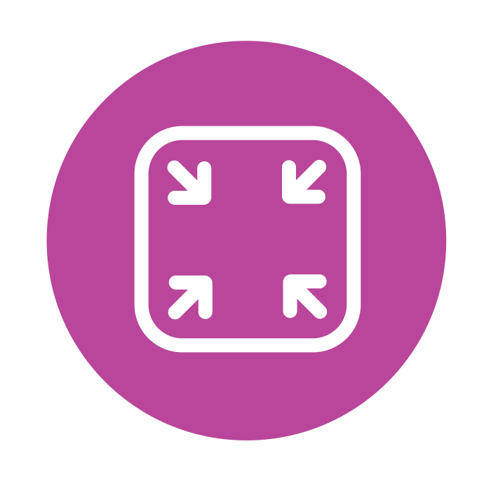

  

<h1 align="center">
  Spectrum
</h1>

  

Note 

1. Download & Install NDK (21.0.75...)

2. Run -> Show error (CMake Error at CMakeLists.txt:43 (add_subdirectory):)
    
solution: Run "./gradlew prepareNativeLibrary" before building project

    <a href="[url](https://github.com/facebookincubator/spectrum/issues/27)">solution link</a>
 
3. Run -> Working
